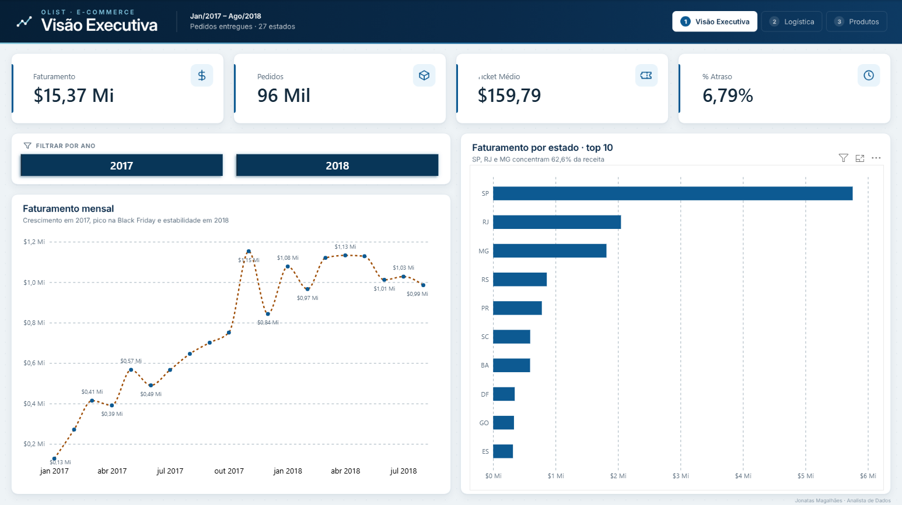
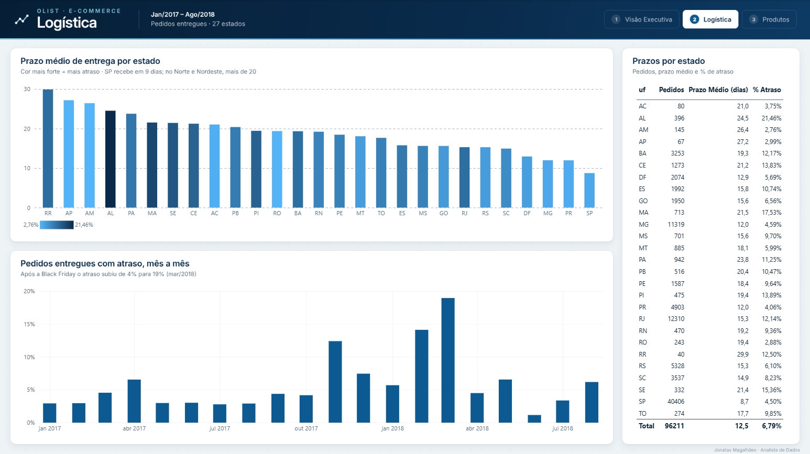
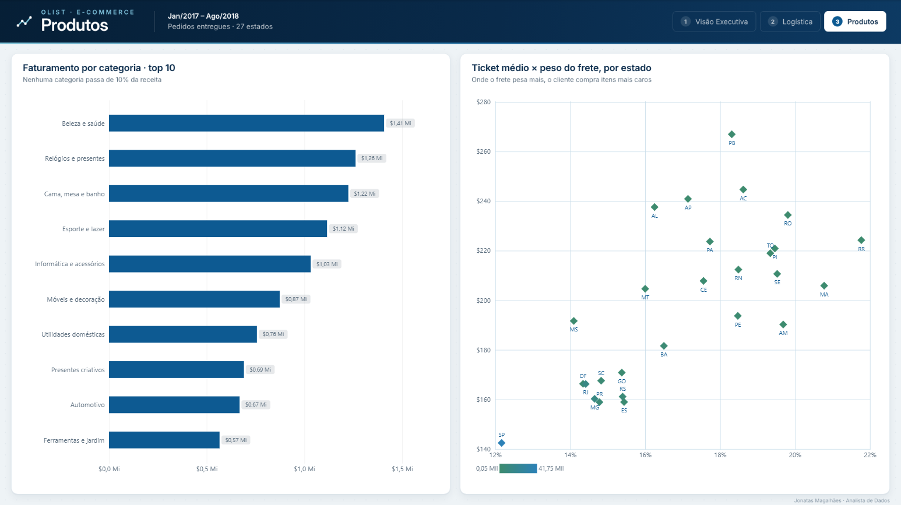
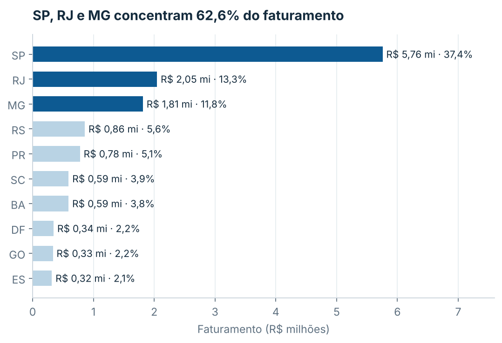
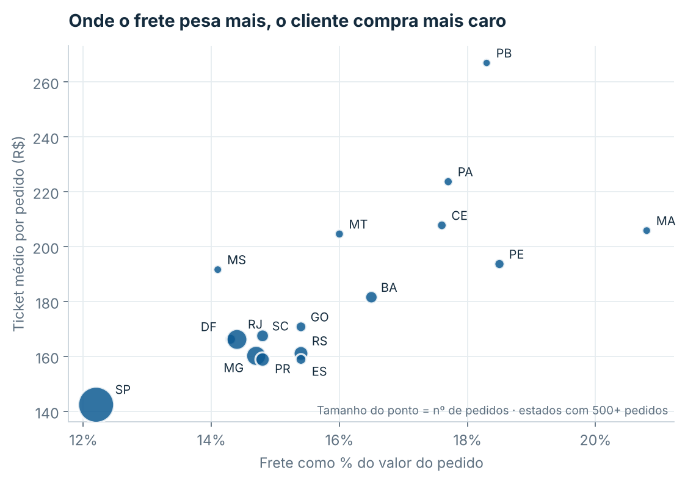
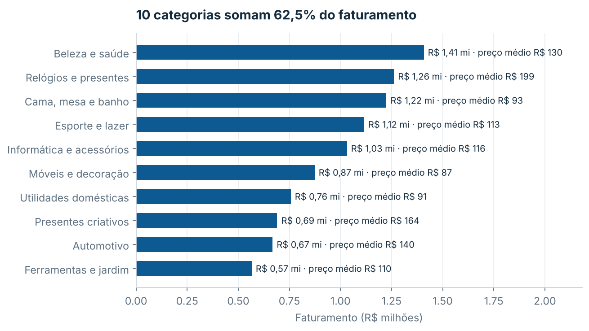
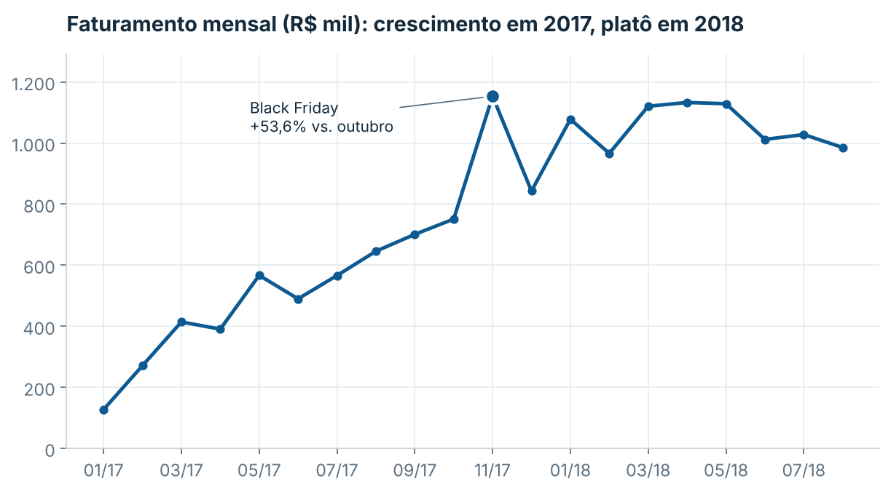
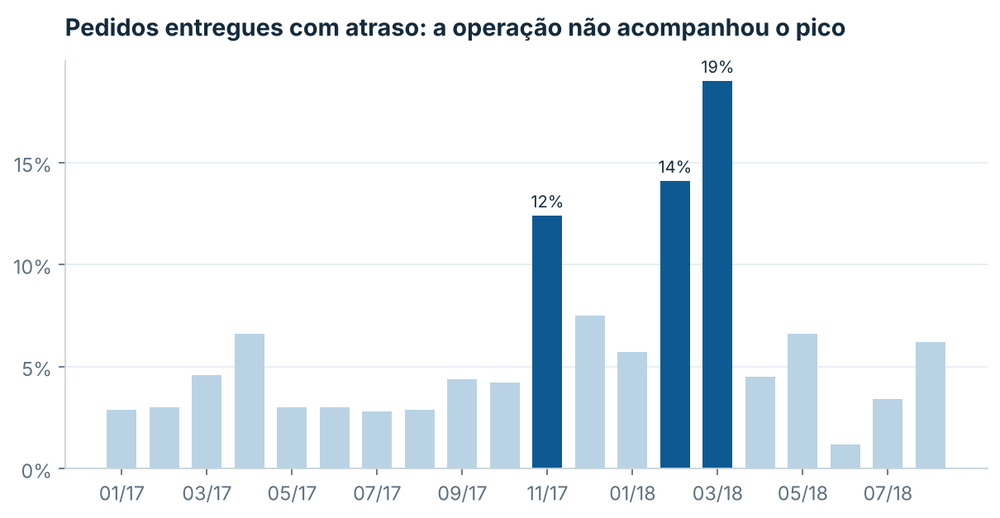
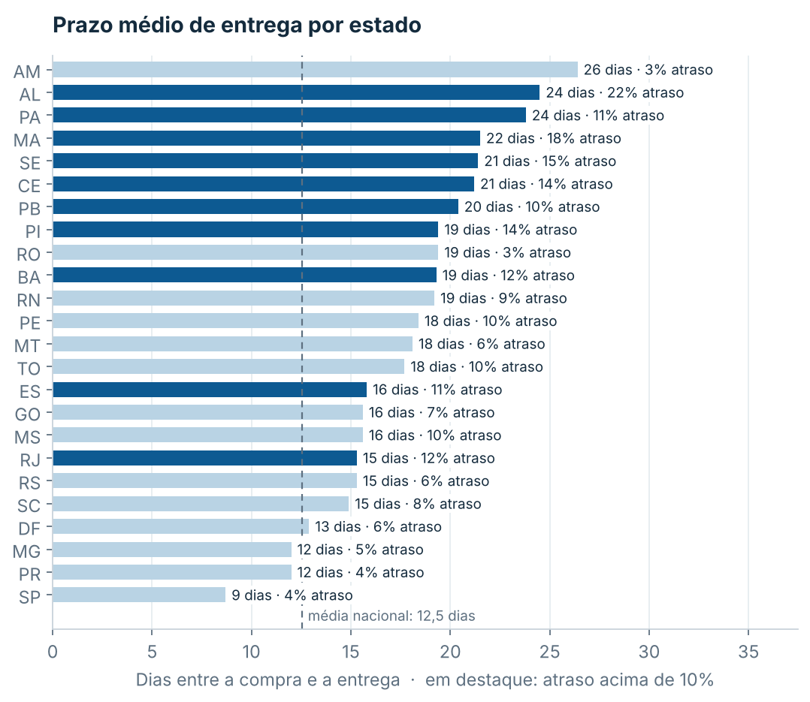
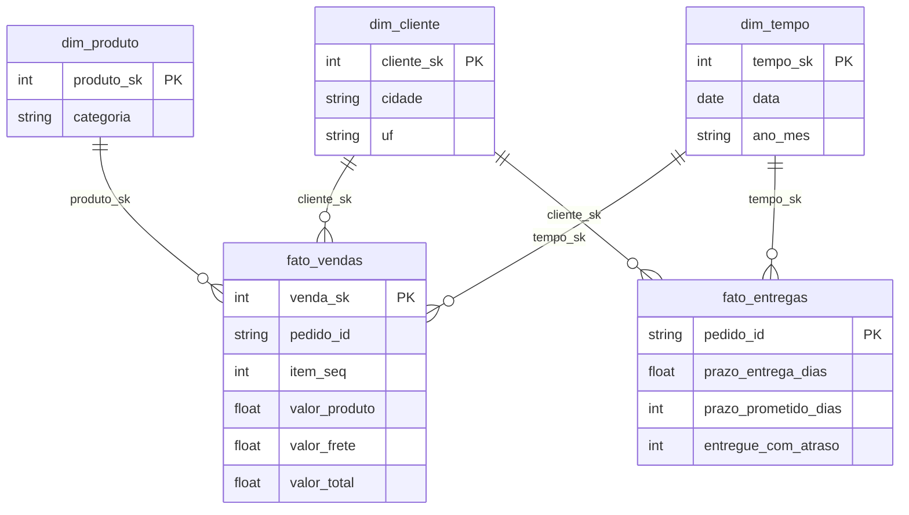

# Análise de E-commerce — Olist

**Do dado transacional à decisão:** ETL em Python, modelo estrela, consultas SQL e conclusões de negócio sobre 110 mil itens vendidos em um marketplace brasileiro (jan/2017 a ago/2018).


---

## Resumo executivo

| Faturamento | Pedidos | Clientes | Ticket médio | Frete no faturamento |
|---|---|---|---|---|
| **R$ 15,37 mi** | **96.211** | **93.104** | **R$ 159,79** | **14,3%** |

1. **Concentração:** SP, RJ e MG somam **62,6%** do faturamento; sete estados chegam a 80,9%.
2. **Crescimento com platô:** jan–ago/2018 faturou **2,4×** o mesmo período de 2017, mas a receita está estável em ~R$ 1,0–1,1 mi/mês desde janeiro de 2018.
3. **A logística não acompanhou o pico:** depois da Black Friday (+53,6% no mês), o atraso subiu de 4% para **19% em março/2018**.
4. **RJ é a principal anomalia:** 2º maior mercado, com **12,1% de atraso**, quase 3 vezes SP (4,5%) e MG (4,6%).
5. **Frete como barreira:** no Nordeste o frete chega a **20,8%** do pedido e o ticket médio é até 87% maior que o de SP. Só compensa comprar itens caros.

---

## Dashboard Power BI

Painel com 3 páginas, montado sobre o modelo estrela gerado pelo ETL. O guia de montagem, as medidas DAX e os modelos visuais estão em [`powerbi/`](powerbi/).

**Visão Executiva:** indicadores principais, evolução mensal e faturamento por estado


**Logística:** prazo médio e taxa de atraso por estado e por mês


**Produtos:** categorias e relação entre peso do frete e ticket médio


---

## Perguntas de negócio e respostas

### Onde está o faturamento?


Três estados concentram quase dois terços da receita. Qualquer falha logística em SP, RJ ou MG afeta mais da metade do negócio.

### O frete limita as vendas fora do Sudeste?


Quanto mais o frete pesa, mais caro é o pedido médio (PB: R$ 266,98; SP: R$ 142,45). O cliente distante só compra quando o valor do item dilui o frete. Isso indica demanda reprimida para itens de menor valor.

### Quais categorias sustentam o negócio?


Receita bem distribuída (nenhuma categoria passa de 10%), com dois perfis distintos: **volume** (Cama, mesa e banho, preço médio de R$ 93) e **valor** (Relógios e presentes, R$ 199).

### Como o faturamento evoluiu?


O ticket médio ficou estável (R$ 146–170) durante todo o período: o crescimento veio de **mais pedidos**, não de pedidos maiores.

### A logística entrega no prazo?




SP recebe em 8,7 dias; Alagoas leva 24,5 dias e atrasa 21,5% dos pedidos. O pico de vendas de nov/2017 gerou uma onda de atrasos que durou até março de 2018.

---

## Recomendações

| # | Achado | Recomendação |
|---|---|---|
| 1 | SP, RJ e MG = 62,6% da receita | Priorizar SLA logístico e estoque nesses três estados |
| 2 | RJ atrasa 12,1% (vs. 4,5% em SP) | Auditar transportadoras e rotas do RJ: maior ganho por esforço |
| 3 | Atraso chegou a 19% após o pico | Planejar capacidade antes de datas sazonais (Black Friday, Natal) |
| 4 | Frete = 18–21% do pedido no Nordeste | Testar frete subsidiado ou CD regional para destravar tickets menores |
| 5 | Receita estável desde jan/2018 | Crescer via recompra e novos mercados, não só via tráfego |

---

## Como o projeto foi construído



**Decisões de modelagem:**
- **Duas tabelas fato com grãos diferentes.** `fato_vendas` tem uma linha por item. `fato_entregas` tem uma linha por pedido. Prazo e atraso são atributos do pedido; se ficassem na fato de itens, seriam contados várias vezes em pedidos com mais de um produto.
- **Dimensão tempo como calendário contínuo**, com chave `AAAAMMDD`. Dias sem venda continuam existindo, o que é essencial para séries temporais no Power BI.
- **Recorte jan/2017 a ago/2018.** 2016 tem só 267 pedidos entregues, com meses de 1 pedido, e distorceria as tendências.
- **Ticket médio calculado por pedido, não por item.** A média por item subestima o valor real da compra.
- **Validações de integridade** (`assert`) ao final do ETL: nenhuma venda sem cliente, produto ou data, e nenhum item duplicado.
- **Conferência cruzada:** o faturamento do modelo foi reconciliado com um cálculo direto nas tabelas de origem (diferença zero).

## Estrutura

```
├── data/
│   ├── raw/                 # dados originais da Olist (OLTP)
│   └── processed/           # modelo estrela em CSV, pronto para o Power BI
├── notebooks/
│   └── analise_olist.ipynb  # análise completa, executada, com gráficos
├── sql/                     # 7 consultas analíticas (CTEs, window functions, HAVING)
├── src/
│   └── etl.py               # extração, tratamento e modelagem dimensional
├── reports/figures/         # gráficos usados neste README
└── powerbi/
    ├── README.md            # guia de montagem do dashboard e medidas DAX
    ├── template/            # planos de fundo das páginas e tema de cores
    └── dados/               # fato_vendas em centavos (Power BI em português)
```

## Como executar

```bash
git clone https://github.com/JonatasMag/analise-ecommerce-olist.git
cd analise-ecommerce-olist
pip install -r requirements.txt

python src/etl.py            # gera o modelo estrela em data/processed/
jupyter notebook notebooks/analise_olist.ipynb
```

O SQL roda em **SQLite**, que já vem com o Python. Não é preciso instalar banco de dados.

## Limitações

- Os dados são públicos e anonimizados, e os valores não têm correção pela inflação.
- A base não traz custo do produto nem custo real do frete. A análise é de **receita**, não de margem.

## Dados e licença

- **Dados:** [Brazilian E-Commerce Public Dataset by Olist](https://www.kaggle.com/datasets/olistbr/brazilian-ecommerce), licença CC BY-NC-SA 4.0.
- **Código:** MIT.

---

**Jonatas Magalhães**: Analista de Dados · Processos · Operações
[LinkedIn](https://www.linkedin.com/in/jonatasmag/) · [Portfólio](https://jonatasmag.github.io) · chazaq.adm@gmail.com
